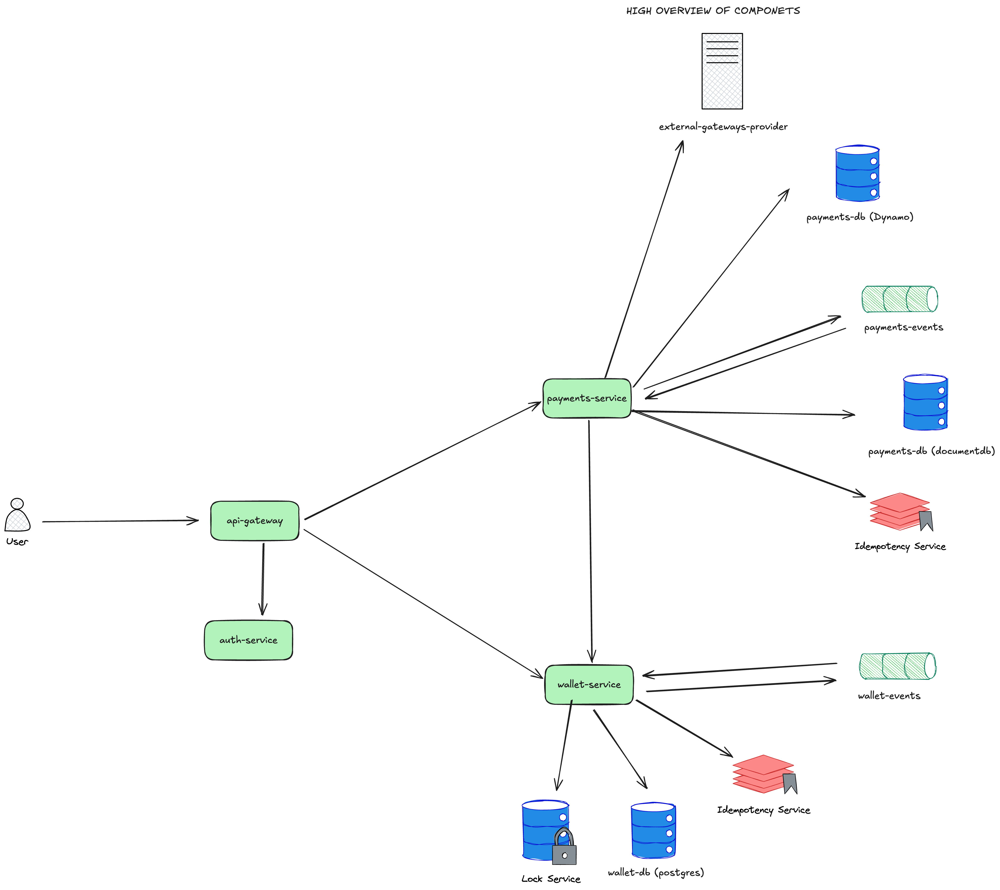
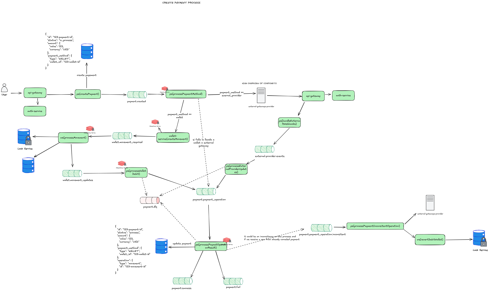
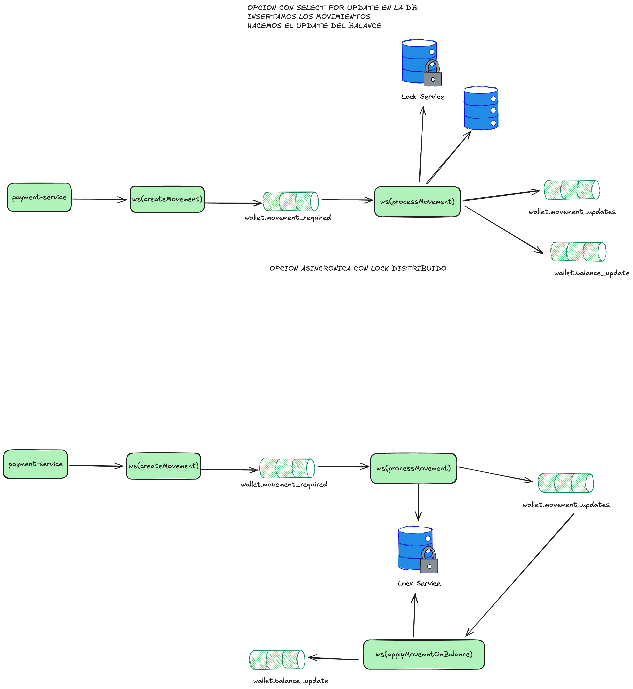

# Draftea Payment System

Event-driven payment system built in Go following hexagonal architecture, event sourcing and choreography-based saga pattern.

## Architecture Overview

The system implements an **event-oriented choreography architecture** where services communicate through domain events without a central orchestrator. Each service reacts to events and publishes new ones, creating a loosely coupled, scalable system.



### Main Components

1. **Payment Service** (Port 8080): Payment management with different payment method providers
2. **Wallet Service** (Port 8081): Wallet management (balance, income, expenses)
3. **Auth Service**: RBAC authentication service _(planned)_
4. **API Gateway**: Service exposing routes to external clients _(planned)_

## Services

### Payment Service

Service dedicated to payment management and processing through different payment methods.

#### Main Entities
- **Payment**: Core payment aggregate
- **Payment Operation**: Individual operations within a payment

#### Key Features
- **Create Payment** (`POST /api/v1/payments`)
- **Refund Payment** (`POST /api/v1/payments/{payment_id}/refund`)
- Multiple payment method support (wallet, external providers)
- Event-driven operation processing
- Automatic compensation handling
- Payment method factory pattern with type-safe creation

#### Payment Flow (Event Choreography)
1. **createPayment**: Creates payment and publishes creation event
2. **processPaymentMethod**: Processes operation based on payment method
3. **processWalletDebit**: Handles wallet service updates
4. **handleExternalWebhooks**: Receives external provider updates
5. **processExternalProviderUpdates**: Converts provider updates to operations
6. **processPaymentOperationResult**: Applies operations to payment
7. **processPaymentInconsistentOperation**: Handles inconsistent payments



### Wallet Service

Service dedicated to user wallet management, handling balances and movements.

#### Main Entities

**Wallet Balance**
```json
{
  "id": "wallet_id",
  "balance": 100,
  "currency": "USD",
  "user_id": "user_id",
  "last_updated": "2024-01-15T10:30:00Z"
}
```

**Movements** (Immutable income/expense records)
```json
{
  "id": "movement_id",
  "type": "income", // or "expense"
  "amount": 100,
  "currency": "USD",
  "wallet_id": "wallet_id",
  "created_at": "2024-01-15T10:30:00Z"
}
```

#### Key Features
- **Create Movement** (`POST /api/v1/wallet/{id}/movement`)
- **Revert Movement** (`POST /api/v1/movement/{movement_id}/revert`)
- **Get Wallet Balance** (`GET /api/v1/wallet/{id}`)
- Atomic balance operations with ACID compliance
- Immutable movement history (income/expense tracking)
- Automatic revert compensation with opposite movements
- Comprehensive OpenTelemetry instrumentation



## Event Catalog

The system uses a comprehensive event catalog for service communication. See [Event Catalog](docs/event-catalog.md) for detailed event schemas.

### Key Domain Events

#### Payment Events
- `payment.created`: Payment initialization
- `payment.payment_operation.completed`: Operation completion (success/fail)
- `payment.payment_operation.inconsistent`: Inconsistent operation handling
- `payment.success`: Payment completed successfully
- `payment.failed`: Payment failed

#### Wallet Events
- `wallet.movement_required`: Movement request
- `wallet.movement_updates`: Movement status updates
- `wallet.balance_update`: Balance change notifications

## Project Structure

```
draftea/
├── docs/                       # Documentation source of truth
│   ├── architecture-overview.md
│   ├── payment-service-overview.md
│   ├── wallet-service-overview.md
│   └── event-catalog.md
├── shared/                     # Shared code
│   ├── models/                # Domain models
│   ├── events/                # Domain events
│   └── infrastructure/        # Event store, messaging
├── payments-service/          # Payment service
│   ├── config/               # Configuration management
│   ├── domain/               # Business logic
│   ├── application/          # Use cases & event handlers
│   ├── infrastructure/       # PostgreSQL repositories
│   └── handlers/             # HTTP endpoints
├── wallet-service/           # Wallet service
│   ├── config/               # Configuration management
│   ├── domain/               # Business logic
│   ├── application/          # Use cases & event handlers
│   ├── infrastructure/       # PostgreSQL repositories
│   ├── handlers/             # HTTP endpoints
│   └── telemetry/           # OpenTelemetry implementation
├── cmd/                      # Main applications
│   ├── payments-service/     # Payment service main
│   └── wallet-service/       # Wallet service main
└── database/                 # Database migrations
    └── migrations/           # SQL schema files
```

## Development Setup

### Prerequisites
- Go 1.23+
- Docker & Docker Compose
- PostgreSQL (optional for local development)

### Configuration System

Each service uses a clean configuration pattern following the timeline-service approach:

```
service/config/
├── config.go        # Configuration structs and loading
├── dependencies.go  # Dependency injection and setup
├── local.json      # Local development settings
└── dev.json        # Docker/production settings
```

**Features**:
- **JSON-based**: Clean, readable configuration files
- **Environment switching**: `ENVIRONMENT=dev` uses `dev.json`
- **Environment overrides**: Any config value can be overridden
- **Backward compatibility**: Existing environment variables still work
- **Dependency injection**: Clean separation of config and dependency setup

### Infrastructure Setup

Use the infrastructure-only Docker Compose for external dependencies:

```bash
# Start PostgreSQL and LocalStack (SQS/SNS)
docker-compose -f docker-compose.infra.yml up -d

# View infrastructure logs
docker-compose -f docker-compose.infra.yml logs -f

# Stop infrastructure
docker-compose -f docker-compose.infra.yml down

# Reset all data (remove volumes)
docker-compose -f docker-compose.infra.yml down -v
```

### Configuration

Each service loads configuration from JSON files with environment variable overrides:

**Local Development** (automatic with `config/local.json`):
```json
{
  "database": {
    "host": "localhost",
    "port": 5433
  },
  "aws": {
    "endpoint_sns": "http://localhost:4566",
    "endpoint_sqs": "http://localhost:4566"
  }
}
```

**Environment Variable Overrides**:
```bash
# Override any config value
DATABASE_URL=postgres://custom-host:5432/db
ENVIRONMENT=dev  # Use dev.json instead of local.json
WALLET_TELEMETRY_ENABLED=false  # Disable telemetry
```

### Build and Run Services

```bash
# Install dependencies
go mod download

# Build all services
make build

# Run services (uses local.json by default)
go run cmd/payments-service/main.go
go run cmd/wallet-service/main.go

# Run with different environment
ENVIRONMENT=dev go run cmd/wallet-service/main.go

# Run tests
make test
go test -v ./...
```

### Available Services

- **Payment Service**: http://localhost:8080
  - API Base: `/api/v1/`
  - Health: `/health`
- **Wallet Service**: http://localhost:8081
  - API Base: `/api/v1/`
  - Health: `/health`
  - Metrics: `/metrics` (Prometheus)
- **LocalStack (AWS)**: http://localhost:4566
- **PostgreSQL**: localhost:5433 (to avoid local conflicts)

## API Usage Examples

### Create Payment

```bash
curl -X POST http://localhost:8080/api/v1/payments \
  -H "Content-Type: application/json" \
  -d '{
    "user_id": "550e8400-e29b-41d4-a716-446655440010",
    "amount": 5000,
    "currency": "USD",
    "payment_method_type": "wallet",
    "wallet_id": "550e8400-e29b-41d4-a716-446655440001",
    "description": "Service payment"
  }'
```

### Get Wallet Balance

```bash
curl http://localhost:8081/api/v1/wallet/550e8400-e29b-41d4-a716-446655440001
```

### Create Wallet Movement

```bash
curl -X POST http://localhost:8081/api/v1/wallet/550e8400-e29b-41d4-a716-446655440001/movement \
  -H "Content-Type: application/json" \
  -d '{
    "type": "income",
    "amount": 10000,
    "currency": "USD",
    "reference": "Manual income",
    "description": "Test income"
  }'
```

### Revert Wallet Movement

```bash
curl -X POST http://localhost:8081/api/v1/movement/movement-id/revert \
  -H "Content-Type: application/json" \
  -d '{
    "reason": "Correction needed",
    "requested_by": "admin"
  }'
```

## Monitoring and Observability

### Event Monitoring with LocalStack

```bash
# List SQS queues
aws --endpoint-url=http://localhost:4566 sqs list-queues

# Receive messages from payment queue
aws --endpoint-url=http://localhost:4566 sqs receive-message \
  --queue-url http://localhost:4566/000000000000/payment-events

# List SNS topics
aws --endpoint-url=http://localhost:4566 sns list-topics
```

### Telemetry (Wallet Service)

The wallet service includes comprehensive OpenTelemetry instrumentation:
- **Traces**: Distributed tracing for request flows
- **Metrics**: Custom business metrics (counters, histograms, gauges)
- **Context Injection**: Middleware-based telemetry context
- **OTLP Export**: Compatible with Jaeger, Zipkin, etc.
- **Prometheus**: Metrics export for monitoring

## Database

PostgreSQL automatically initializes with:
- Event sourcing tables (`event_stream`, `snapshots`)
- Domain aggregate tables (`payments`, `wallets`, `wallet_transactions`, `wallet_movements`)
- Optimized indexes
- Sample test data (3 wallets with balances)

### Test Data

Pre-configured test wallets:
- **Wallet 1**: `550e8400-e29b-41d4-a716-446655440001` (User: `550e8400-e29b-41d4-a716-446655440010`) - $1,000.00 USD
- **Wallet 2**: `550e8400-e29b-41d4-a716-446655440002` (User: `550e8400-e29b-41d4-a716-446655440011`) - $500.00 USD
- **Wallet 3**: `550e8400-e29b-41d4-a716-446655440003` (User: `550e8400-e29b-41d4-a716-446655440012`) - €750.00 EUR

## Architecture Patterns

### ✅ Implemented
- **Hexagonal Architecture**: Clean separation of concerns
- **Event Sourcing**: PostgreSQL as event store with immutable events
- **Saga Choreography**: Event-driven coordination without central orchestrator
- **CQRS**: Command Query Responsibility Segregation
- **Repository Pattern**: Domain-driven data access
- **Factory Pattern**: Type-safe object construction
- **Event-Driven Architecture**: Asynchronous service communication
- **OpenTelemetry**: Comprehensive observability (Wallet Service)
- **Configuration Management**: JSON-based config with environment overrides
- **Dependency Injection**: Clean dependency management pattern

### Domain-Driven Design
- **Aggregates**: Payment, Wallet, Transaction
- **Domain Events**: Rich event catalog for business events
- **Value Objects**: Money, ID types
- **Domain Services**: Business logic encapsulation

## Next Steps

For production deployment:

1. **Gateway Service**: Real payment provider integration (Stripe, PayPal)
2. **Auth Service**: RBAC authentication and authorization
3. **API Gateway**: External API exposure and rate limiting
4. **Enhanced Observability**: Structured logging, alerting
5. **Security**: Authentication, encryption, input validation
6. **Testing**: Comprehensive test coverage (unit, integration, e2e)
7. **Resilience**: Circuit breakers, retry policies, timeouts
8. **Deployment**: Kubernetes, CI/CD pipelines

---

This system demonstrates a modern microservices architecture implementing saga choreography with event sourcing, following domain-driven design principles and providing comprehensive observability capabilities.