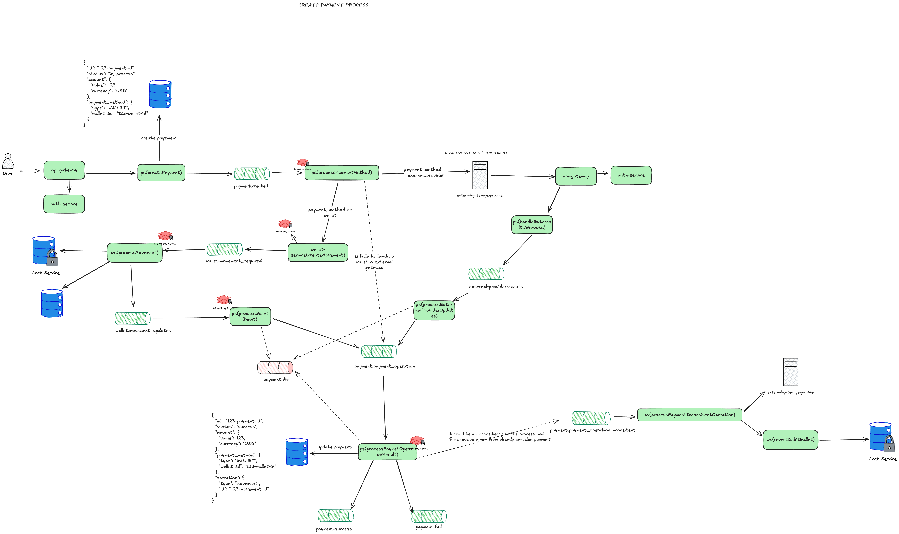

# Payment service

## Description

Service dedicated to the management and processing of payments through different payment methods.

......

## Main Entities

1. **Payment**
2. **Payment Operation**

## Features

### Create Payment

POST /api/v1/payments

The flow of creating a payment in an event-oriented architecture occurs in several steps which we will isolate into so-called use cases,
each responsible for a specific action avoiding the overload of responsibilities:

1. **createPayment**: Creates a Payment in the database and publishes its creation
2. **processPaymentMethod**: Receives a created payment and processes the corresponding operation based on the payment method to use that method.
3. **processWalletDebit**: Listens to updates issued by the wallet service and understands which ones correspond to an operation and converts this update into a paymentOperation
4. **handleExternalWebhooks**: Endpoint to receive updates from external payment providers
5. **processExternalProviderUpdates**: Converts and filters updates from an external provider into a paymentOperation
6. **processPaymentOperationResult**: Receives a paymentOperation and applies it to the payment according to how that operation was performed on the payment.
7. **processPaymentInconsistentOperation**: Processes inconsistent payments by refunding and rolling back the paymentOperations

### Refund Payment

POST /api/v1/payments/{payment_id}/refund

The flow of refunding a payment involves doing a refund/revert of the paymentOperations that were part of the payment and then marking the payment as refunded

1. **refundPayment**: Publishes the update to begin the refund process of a payment
2. **processRefund**: Receives the refund update and based on the operation type goes against wallet or the corresponding provider for the payment operation
3. **processWalletDebit**: Listens to updates issued by the wallet service and understands which ones correspond to an operation and converts this update into a paymentOperation
4. **handleExternalWebhooks**: Endpoint to receive updates from external payment providers
5. **processPaymentOperationResult**: Receives a paymentOperation and applies it to the payment according to how that operation was performed on the payment.
6. **processPaymentInconsistentOperation**: Processes inconsistent payments by refunding and rolling back the paymentOperations

