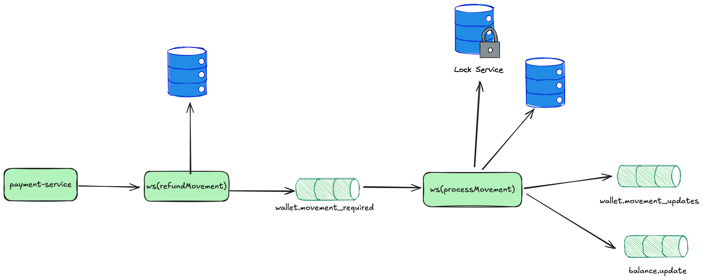

# Wallet service

## Description

Service dedicated to user wallet management. Manages balances and movements of the same

......

## Main Entities

1. **Wallet Balance**
 ```json
{
  "id": "wallet_id",
  "balance": 100,
  "currency": "USD",
  "user_id": "user_id",
  "last_updated": ""
}
```
2. **Movements** User money movements that can be income or expense (they are immutable)
 ```json
{
  "id": "movement_id",
  "type": "income",//expense
  "amount": 100,
  "currency": "USD",
  "wallet_id": "user_id",
  "created_at": ""
}
```
## Features

### Request expense to balance

This service maintains the movement tables (income and expense of the user) as well as their balance.

For the generation and application of movements, 2 possible solutions are proposed: 1 more asynchronous and another more synchronous that generates stronger consistency based on ACID

Both movement and revert movement create movements since the revert generates the opposite movement to the original movement, meaning if it was income it creates expense or vice versa.
The idea is that these movements are atomic and show the balance history.

POST /api/v1/wallet/{id}/movement


POST /api/v1/movement/{movement_id}/revert



GET /api/v1/wallet/{id}

Get wallet balance

